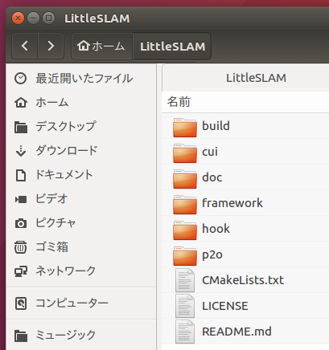
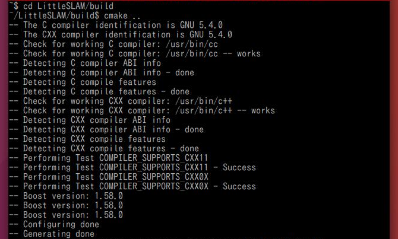
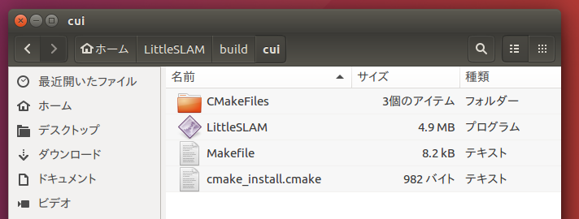
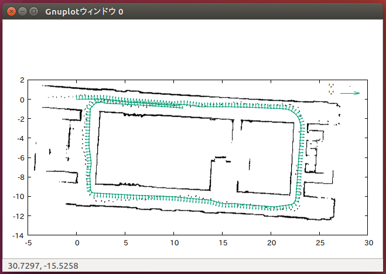

## LittleSLAMの使い方（Linuxの場合）

### (1) 関連ソフトウェアのインストール

- C++コンパイラ(gcc)、Boost、Eigen、CMake, gnuplot  
以下のコマンドで、まとめてインストールします。

</code></pre>
<pre><code> $ sudo apt-get install build-essential cmake libboost-all-dev libeigen3-dev gnuplot gnuplot-x11
</code></pre>

- p2o  
[p2o](https://github.com/furo-org/p2o)のGithubサイトを開きます。以下のどちらかの方法でp2oをダウンロードします。  
(A) Github画面の"Clone or download"ボタンを押して、"Download ZIP"を選択し、
p2o-master.zipをダウンロードします。zipファイルの展開方法は後述します。  
(B) gitを使って、リポジトリをcloneします。  

### (2) LittleSLAMのインストール

- LittleSLAMの展開  
[LittleSLAM](https://github.com/furo-org/LittleSLAM)のGithubサイトを開きます。
以下のどちらかの方法でLittleSLAMをダウンロードします。  
(A) Github画面の"Clone or download"ボタンを押して、"Download ZIP"を選択し、
LittleSLAM-master.zipをダウンロードします。
そして、このzipファイルを適当なディレクトリに展開します。
ここでは、たとえば、"\~/LittleSLAM"に展開するとします。
LittleSLAM-master.zipの中の"LittleSLAM-master"ディレクトリの下の
4個のディレクトリと3個のファイルを"\~/LittleSLAM"の下にコピーします。  
(B) gitを使って、リポジトリをcloneします。
```
git clone --recursive https://github.com/furo-org/LittleSLAM.git
```
この方法を使った場合は次の「p2oの展開」の操作は不要です。

- p2oの展開  
前述のp2o-master.zipの中のファイル"p2o.h"を"\~/LittleSLAM/p2o"にコピーします。  

- buildディレクトリの作成  
"\~/LittleSLAM"の下にbuildディレクトリを作成します。  
ここまでのディレクトリ構成は以下のようになります。



- CMakeの実行  
コンソールで、buildディレクトリに移動し、cmakeを実行します。

</code></pre>
<pre><code> ~/LittleSLAM$ cd build
</code></pre>
<pre><code> ~/LittleSLAM/build$ cmake ..
</code></pre>

下図にcmakeの実行例を示します。



あるいは、CMakeのGUI版をインストールして、Windowsの場合と同じように
GUIでCMakeを実行することもできます。

- ビルド  
コンソールで、buildディレクトリにおいてmakeを実行します。  
</code></pre>
<pre><code> ~/LittleSLAM/build$ make
</code></pre>
ビルドが成功すると、"\~/LittleSLAM/build/cui"ディレクトリに、実行ファイルLittleSLAMが生成されます。  



### (3) 実行

以下のコマンドで、LittleSLAMを実行します。

</code></pre>
<pre><code> ./LittleSLAM [-so] データファイル名 [開始スキャン番号]
</code></pre>

-sオプションを指定すると、スキャンを1個ずつ描画します。各スキャン形状を確認したい場合に
使います。  
-oオプションを指定すると、スキャンをオドメトリデータで並べた地図
（SLAMによる地図ではない）を生成します。  
オプション指定がなければ、SLAMを実行します。  
開始スキャン番号を指定すると、その番号までスキャンを読み飛ばしてから実行します。

例として、以下のコマンドでSLAMを実行します。  
この例では"\~/LittleSLAM/dataset"ディレクトリに"corridor.lsc"というデータファイルが置かれています。  
</code></pre>
<pre><code> ~/LittleSLAM/build/cui$ ./LittleSLAM ~/LittleSLAM/dataset/corridor.lsc
</code></pre>

  
  
コマンドを実行すると、LittleSLAMはファイルからデータを読み込んで地図を少しずつ
構築していきます。その様子がgnuplotに描画されます。  
最終的に、下図のような地図が生成されます。  
処理が終わっても、プログラムは終了せず、地図はそのまま表示されています。  
プログラムを終了するにはCtrl-Cを押してください。

　

