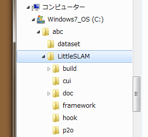
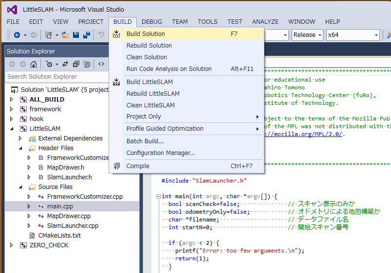
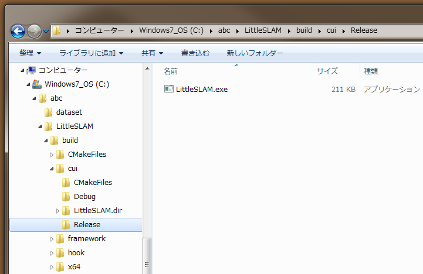
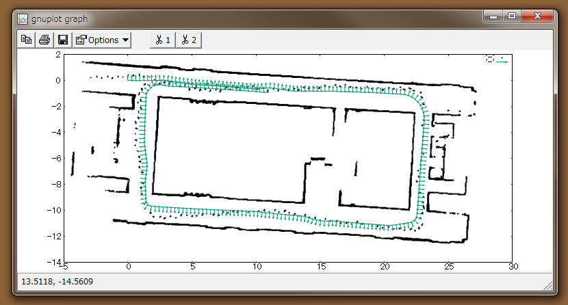

## LittleSLAMの使い方 （Windowsの場合）

### (1) 関連ソフトウェアのインストール

- Boost  
[Boost](http://www.boost.org/)をダウンロードして、適当なフォルダに解凍します。  
LiitleSLAMでは、Boostのヘッダファイルだけを使用するので、ビルドは必要ありません。

- Eigen3  
[Eigen](http://eigen.tuxfamily.org/index.php?title=Main_Page)を
ダウンロードして、適当なフォルダに解凍します。  
Eigenはヘッダファイルだけで使用するライブラリなので、ビルドは必要ありません。

- gnuplot  
[gnuplot](http://www.gnuplot.info/)をダウンロードしてインストールします。 
LittleSLAMからは、APIではなく、実行コマンドで呼び出すので、
Windowsの環境変数Pathにgnuplotのパスを設定しておきます。  
たとえば、gnuplotをフォルダC:\gnuplotにインストールした場合、"Path=... ;C:\gnuplot\bin; ..."とします。  
（インストーラが自動で設定してくれることもあります）

- CMake  
[CMake](https://cmake.org/)をダウンロードしてインストールします。

- p2o  
[p2o](https://github.com/furo-org/p2o)のGithubサイトを開きます。以下のどちらかの方法でp2oをダウンロードします。  
(A) Github画面の"Clone or download"ボタンを押して、"Download ZIP"を選択し、
p2o-master.zipをダウンロードします。zipファイルの展開方法は後述します。  
(B) gitを使って、リポジトリをcloneします。  

### (2) LittleSLAMのインストール

- LittleSLAMの展開  
[LittleSLAM](https://github.com/furo-org/LittleSLAM)のGithubサイトを開きます。
以下のどちらかの方法でLittleSLAMをダウンロードします。  
(A) Github画面の"Clone or download"ボタンを押して、"Download ZIP"を選択し、
LittleSLAM-master.zipをダウンロードします。
そして、このzipファイルを適当なフォルダに展開します。
ここでは、たとえば、"C:\abc\LittleSLAM"に展開するとします。
"abc"はユーザが決める任意のフォルダです。
LittleSLAM-master.zipの中の"LittleSLAM-master"フォルダの下の
4個のフォルダと3個のファイルを"C:\abc\LittleSLAM"の下にコピーします。  
(B) gitを使って、リポジトリをcloneします。  
```
git clone --recursive https://github.com/furo-org/LittleSLAM.git
```
この方法を使った場合は次の「p2oの展開」の操作は不要です。

- p2oの展開   
前述のp2o-master.zipの中のファイル"p2o.h"を"C:\abc\LittleSLAM\p2o"の下にコピーします。  

- buildフォルダの作成  
"C:\abc\LittleSLAM"の下にbuildフォルダを作成します。  
ここまでのフォルダ構成は以下のようになります。



- CMakeの実行  
CMake(GUI)を実行して、LittleSLAM.slnを生成します。  
まず、"Where is the source code"欄および"Where to buid the binaries"欄に下図のフォルダを指定します。  
次に、 Configureボタンを押します。  
LittleSLAMに対して初めてCMakeを実行する場合、下図のようにC++コンパイラを聞かれるので、
使用しているC++コンパイラを指定し、"Use default native compliers"を選択して、Finishボタンを押します。  
そして、もう一度、Configureボタンを押し、最後にGenerateボタンを押します。


- Eigen3の指定   
もし、CMakeがEigen3の場所（EIGEN3_INCLUDE_DIR）を見つけられずにエラーが出た場合は、
次のいずれかを行って、CMakeを再起動してConfigureとGenerateをやり直してください。  
(A) Windowsのシステム環境変数にEIGEN3_ROOT_DIRを追加して、
そこにEigen3を展開したフォルダを設定します。  
すると、下図のように、"C:\abc\LittleSLAM"下のcui, framework, hookの各CMakeLists.txtの中で、
EIGEN3_ROOT_DIRで指定されたフォルダがEIGEN3_INCLUDE_DIRに設定されます。  
(B) 各CMakeLists.txtのEigen3のフォルダを手で設定します。
たとえば、Eigen3を"C:\eigen"に展開した場合は、下図の
$ENV{EIGEN3_ROOT_DIR}の部分をC:\eigenに書き換えます。  

```
-- CMakeLists.txtより抜粋 --

find_package(Eigen3)  
IF(NOT EIGEN3_INCLUDE_DIR)          # Eigen3のパスが見つからない
  set(EIGEN3_INCLUDE_DIR $ENV{EIGEN3_ROOT_DIR})
ENDIF() 
```  

- Visual studioの起動  
"C:\abc\LittleSLAM\build"の下にLittleSLAM.slnができているので、
それをダブルクリックすると、Visual studioが起動します。

- ビルド  
下図のように、Visual studioで、Release, x64（64ビットの場合）を指定し、BuildメニューからBuild Solutionを実行します。




ビルドが成功すると、"build\cui\Release"フォルダに、実行ファイルLittleSLAM.exeが生成されます。  



### (3) 実行

Windowsコマンドプロンプトから以下のコマンドにより、LittleSLAMを実行します。

</code></pre>
<pre><code> LittleSLAM [-so] データファイル名 [開始スキャン番号]
</code></pre>

-sオプションを指定すると、スキャンを1個ずつ描画します。各スキャン形状を確認したい場合に
使います。  
-oオプションを指定すると、スキャンをオドメトリデータで並べた地図
（SLAMによる地図ではない）を生成します。  
オプション指定がなければ、SLAMを実行します。  
開始スキャン番号を指定すると、その番号までスキャンを読み飛ばしてから実行します。

例として、以下のコマンドでSLAMを実行します。  
この例では"C:\abc\dataset"フォルダに"corridor.lsc"というデータファイルが置かれています。  
</code></pre>
<pre><code> C:\abc\LittleSLAM\build\cui\Release> LittleSLAM C:\abc\dataset\corridor.lsc
</code></pre>

  
  
コマンドを実行すると、LittleSLAMはファイルからデータを読み込んで地図を少しずつ
構築していきます。その様子がgnuplotに描画されます。  
最終的に、下図のような地図が生成されます。  
処理が終わっても、プログラムは終了せず、地図はそのまま表示されています。  
プログラムを終了するにはCtrl-Cを押してください。





